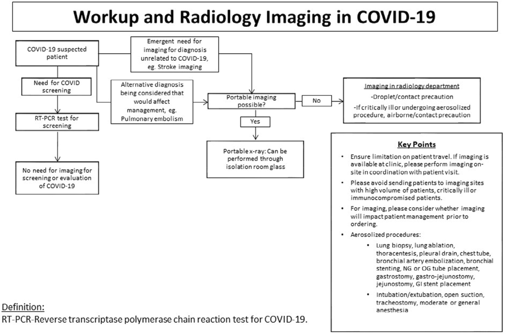
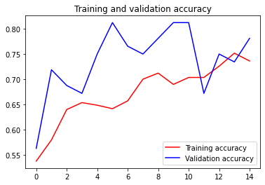
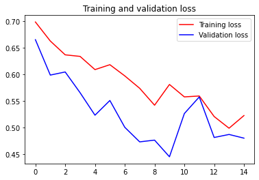
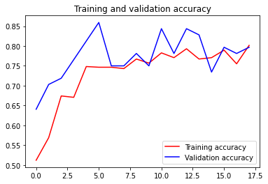
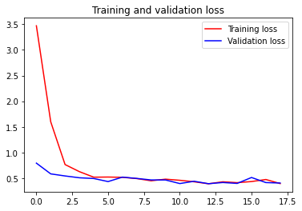
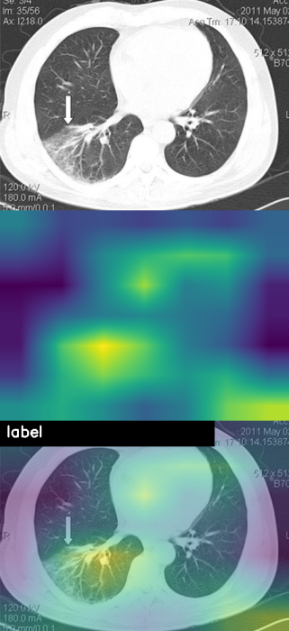

# Diagnosing COVID-19 using AI-based medical image analyses

This is our submission for [SAMHAR-COVID19 Hackathon](https://samhar-covid19hackathon.cdac.in/) organized by the Government of India.

Team Name : **Flatpex**

[Front-End Mockup](http://gamezordd.github.io/COVID_FrontEnd)

---
- [About](#about)

- [Issues faced](#issues-faced)

- [Problem Statement](#problem-statement)

- [Present Guidelines](#present-guidelines)

- [Dataset](#dataset)

- [Our Approach](#our-approach)

- [Results](#results)

- [Further Improvements](#further-improvements)

- [References](#references)
---

## About

COVID-19 is disrupting large parts of the world. We know little about the best way to get to a diagnosis, about what prognoses are implied, let alone what treatment works best in specific situations. We all need to join forces to get this virus under control. 

The current diagnostic pathway looks like this:
* Laboratory testing for COVID-19 diagnosis (RT-PCR)
* Medical imaging-based methods for COVID-19 diagnosis

AI-based CT assessment is seen as one of the promising techniques that might lift some of the heavy weight of the physicians’ shoulders.

## Issues Faced

Let's take CT based assessment techniques. A question arises on how to differentiate between COVID-19 and a pneumonia with different causes? Also, CT scanners have good sensitivity but specificity is on the lower side. Also, contamination of scanners is also a real issue

Other imaging modalities have received less attention from the AI-community so far. X-ray, while easier to obtain in most clinical settings, has only been sparingly investigated. ***The problem with X-Rays is that they are not specific.***

Imaging is performed in COVID-19 positive or suspected patients, to rule out other diagnoses that can be treated, including pulmonary embolism, but is ***not routinely used*** for COVID-19 screening. 

Any imaging suite – and all surfaces – used for scanning a patient suspected of COVID-19 infection should be environmentally cleaned and decontaminated by someone wearing proper protective equipment. The air-flow in fixed X-ray or CT rooms should also be considered before bringing in the next patient. Consider the air exchange rates, understanding that rooms may need to be completely avoided for roughly an hour after imaging infected patients.

All in all, the *current situation requires fast, widely accessible diagnostic tools* which would preferably be available yesterday. 

## Problem Statement

### Title: Diagnosing COVID-19 using AI-based medical image analyses

Radiologists have watched the coronavirus disease 2019 (COVID-19) pandemic unfold. Radiology literature suggests a pivotal role for CT/X-RAYas CT/X-Ray findings in Covid-19 patient has pneumonia, and hence medical imaging has high sensitivity for diagnosis of COVID-19. The objective of this statement is to figure out usage of AI in medical imaging modalities for fast and accurate diagnosis of COVID-19

Expected Outcome: Diagnosing or detecting patients infected with COVID19 using chest radiography images 

</img>

## Present Guidelines

The American College of Radiology (ACR) released its first official guidance for radiologists facing the expanding COVID-19 pandemic. Based on their research, the ACR made these four recommendations:

* CT should not be used to screen for or as a first-line test to diagnose COVID-19
* CT should be used sparingly and reserved for hospitalized, symptomatic patients with specific clinical indications for CT. Appropriate infection control procedures should be followed before scanning subsequent patients
* Facilities may consider deploying portable radiography units in ambulatory care facilities for use when chest X-rays are considered medically necessary
* Radiologists should familiarize themselves with the CT appearance of COVID-19 infection in order to be able to identify findings consistent with infection in patients imaged for other reasons

## Dataset

We have used 746 CT scans from [this](https://www.kaggle.com/luisblanche/covidct) Kaggle dataset

## Our Approach

[Jupyter Notebook](Covid_Predictions.ipynb)

* The data was split in a **0.7,0.1,0.1** (**train,val,test**) ratio.
* The images were found to be vastly varying in dimensions. All were rescaled to a certain dimension
* We tested two models - a simple CNN and another CNN with VGG16 pre-trained network as backbone
* A GradCAM visualization was carried out on a random image to show heatmap of last layer activations

(Yet to be implemented)
* The best model weights are to be saved and then, using Flask, we deploy the model on Heroku
* The [Sample Front-End](http://gamezordd.github.io/COVID_FrontEnd) is just an early version of our implementation
* The website is to be used by doctors to act as an initial screening test. We enter our details, address and upload the CT scan. Using geocoding, the latitude and longitude of our address is saved into the database and map is refreshed.  
* If the model prediction returns positive, the coordinates can be stored and sent to the Police Department for surveillance if needed

## Results 

* The results were relatively accurate and model *converged steadily* given the huge variance in the dataset, in terms of size, brightness, type of scanner etc.
* The results can be greatly improved with a consistent dataset and proper labeling

### **For first model**

</img></img>

|      Metric       |   Test Accuracy  |
| -------------     |:----------------:|
|Accuracy           |      0.441558    |
|Precision          |      0.461538    |
|Recall             |      0.292683    |
|F1 score           |      0.358209    |
|ROC AUC            |      0.451897    |
|Confusion Matrix   |      [[22 14]    |
|                   |       [29 12]]   |

### **For second fine-tuned model**

</img></img>

|      Metric       |   Test Accuracy  |
| -------------     |:----------------:|
|Accuracy           |      0.480519    |
|Precision          |      0.513514    |
|Recall             |      0.463415    |
|F1 score           |      0.487179    |
|ROC AUC            |      0.481707    |
|Confusion Matrix   |      [[18 18]    |
|                   |       [22 19]]   |

### GradCAM

</img>

## Further Improvements

The model converges steadily. But *due to the variation in dataset*, accuracy metrics aren't able to improve even after **test-time augmentation**. To battle this, the model needs to be trained on sufficient number of images with enough variation to make the model have better generalization capacity. 

Future work to make a full-fleged platform is:
* Enter patient details, basic info and address. Then geotag based on GPS coordinates from address
* Identify mobile operator from phone number. If prediction is positive, get Location Based Services Data (LBS) to get location history from telecom operators
* Upload the CT scan and get predictions. If positive - **Tag, Track, Confine** , if negative - **Self-quarantine**
* Preventive Measures
	- Register mobile numbers of all family members in the same house
	- Tag, Track, Confine all those people
	- Register mobile numbers of residents within 1Km radius if number of cases is high
	- Tag, Track, Confine them too
* Alert Mechanisms
	- All mobiles of people in confinement zones should be **monitored for movements 24/7** (Geofencing)
	- If anybody moves outside defined area send alert to police patrols in that jurisdiction

To improve model accuracy we could obtain a proper dataset of CT scans and **collaborate with Radiologists to produce segmentation masks** so that the model acctually searches for symptoms of COVID in CT scans.

## References
1. https://www.quantib.com/blog/diagnosing-covid-19-using-ai-basedmedical-image-analyses
2. https://pubs.rsna.org/doi/10.1148/radiol.2020201326
3. https://www.diagnosticimaging.com/coronavirus/acr-releases-ct-and-chest-x-ray-guidance-amid-covid-19-pandemic
4. https://www.pyimagesearch.com/2020/03/09/grad-cam-visualize-class-activation-maps-with-keras-tensorflow-and-deep-learning/
5. https://www.kaggle.com/luisblanche/covidct
